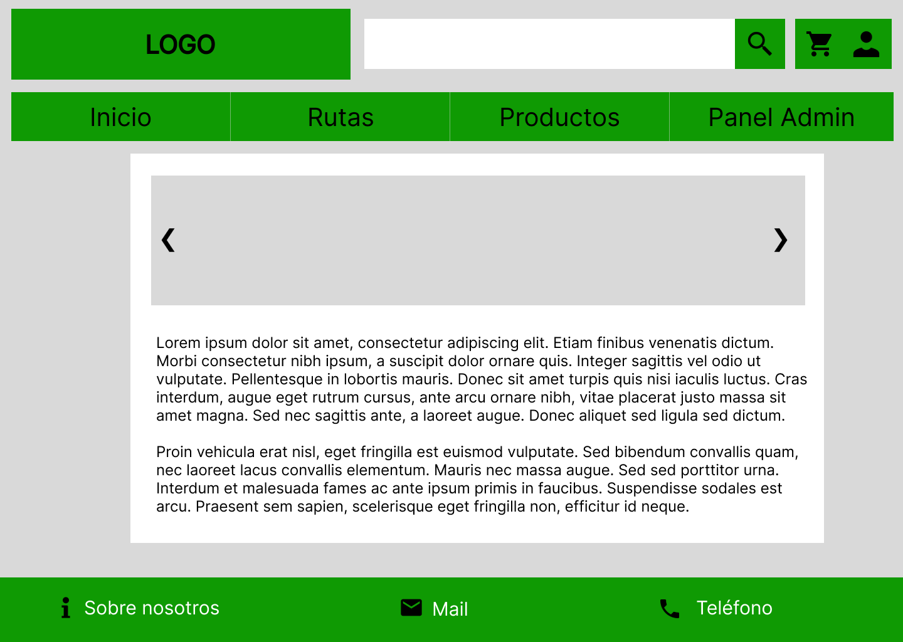

# TAD_Grupo1 - Nature Hub
Repositorio para el proyecto de EPD del Grupo 1 de la asignatura TAD de la UPO.

# Integrantes
- Pablo Hidalgo Prados
- Antonio José Guerrero Aguilar
- Michal Dzienisik

# Objetivos del proyecto
Nuestra implementación debe abarcar todos los principales aspectos de un comercio electrónicos, destacando especialmente las compras y gestión de usuarios dentro del mismo. Asimismo, debemos aplicar los conocimientos adquiridos en la asignatura para crear un portal web apoyado en Laravel, Bootstrap y Vite.

# Modelo UML de la Base de Datos

# Mockup
### Inicio

### Panel de administración

### Productos

### Vista desde móvil

# Decisiones de diseño
Apoyados en la plataforma Coolors, se ha buscado utilizar una paleta de colores que pudiera acompañar de manera elegante al color principal de nuestro proyecto: el verde.

- rbg(56, 102, 65) --> Barra de navegación superior y footer 

- rbg(167, 201, 87) --> Detalles a lo largo del sitio web

- rbg(242, 232, 207) --> Fondo del portal

# Caso de uso principal
Los clientes de nuestro sistema pueden realizar compras a través de un carrito de compra personal. A través de un listado de productos, pueden añadirlos a su carro para, posteriormente, escoger la cantidad de los mismos, una dirección de entrega y un código de descuento en caso de tenerlo. Una vez finalizada la compra, el cliente puede visualizar el estado de la misma en la sección correspondiente en su perfil, así como revisar compras anteriores.

Los usuarios administradores tienen un amplio control sobre las compras de los usuarios clientes, pudiendo visualizarlas y modificando el estado de las mismas.

